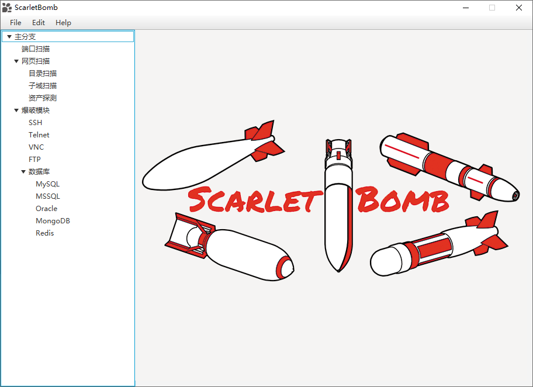
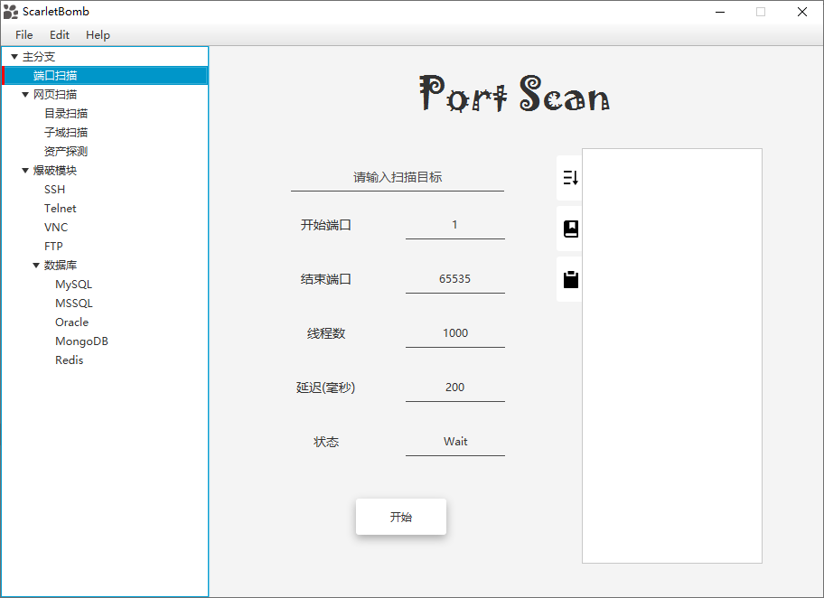
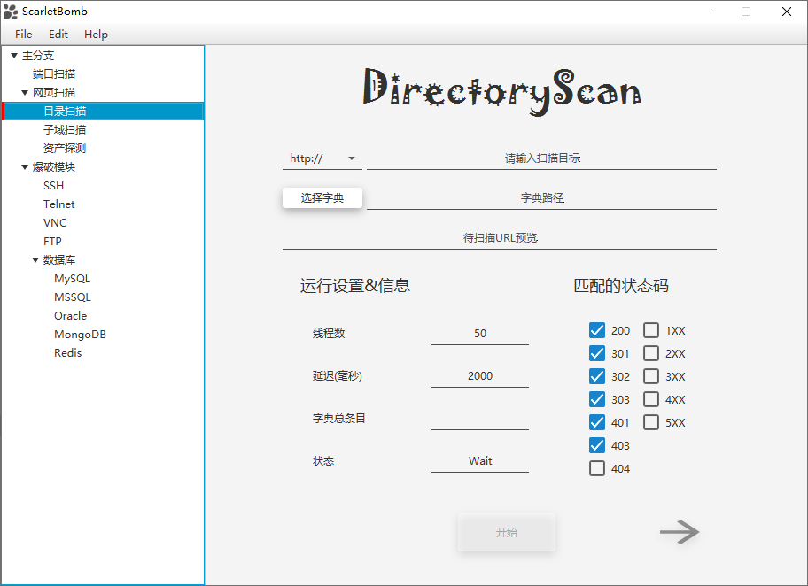

    

# ScaletBomb

**一款用来进行扫描与FUZZ的工具**

- 使用java 8编写
- UI框架为JAVAFX
- 不定期更新

## 已完成的功能
- 端口扫描
- 网页扫描
    - 目录扫描
    
## 预定制作的主要功能

- 端口扫描
- 网页扫描
    - 目录扫描
    - 子域扫描
    - 资产探测(目标探活)
- 爆破模块 
    - SSH
    - Telnet 
    - VNC 
    - FTP 
    - 数据库 
        - MySQL 
        - MSSQL 
        - Oracle 
        - MongoDB 
        - Redis 

## 预定制作的次要功能
- 语言切换

# 界面预览

# 免责声明

本人编写的工具,仅供学习和研究使用,请勿使用文中的技术源码用于非法用途,任何人造成的任何负面影响,与本人无关.
